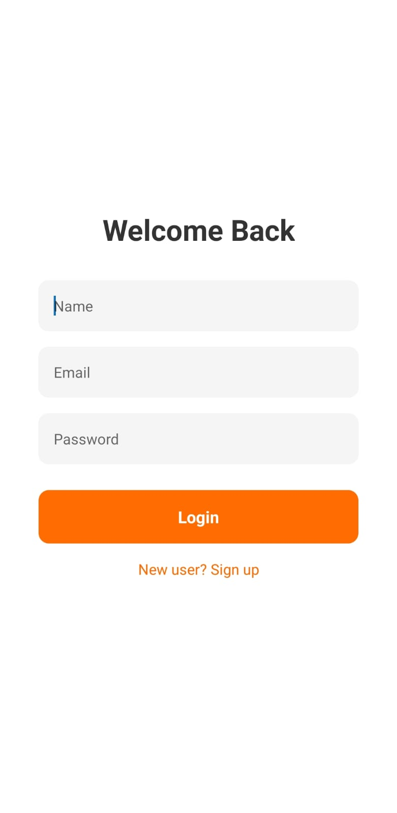
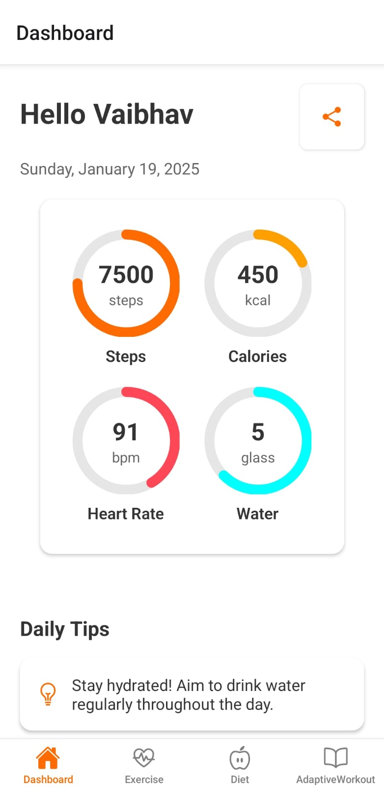
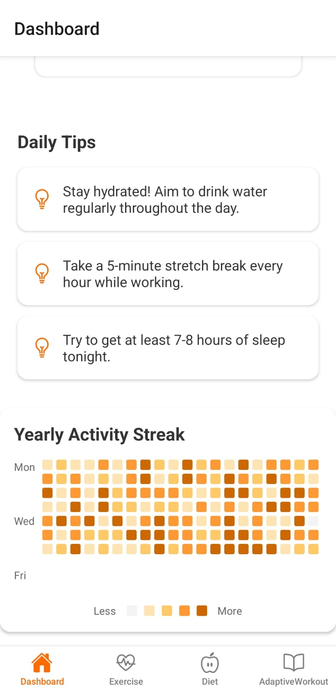
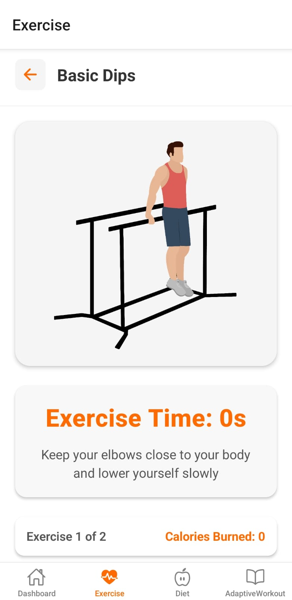
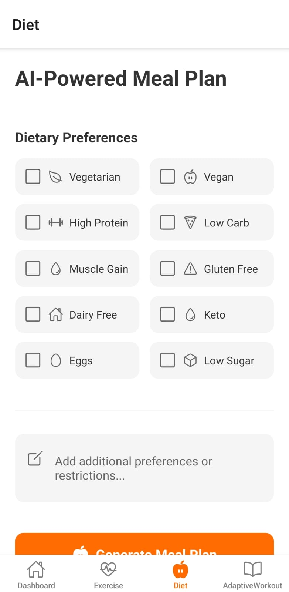
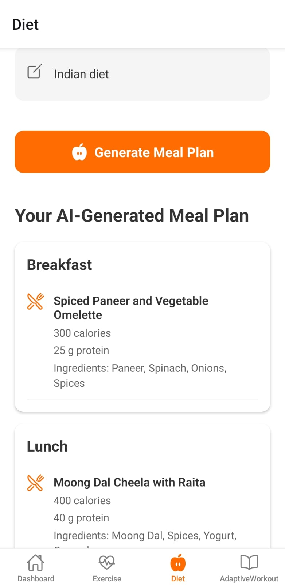
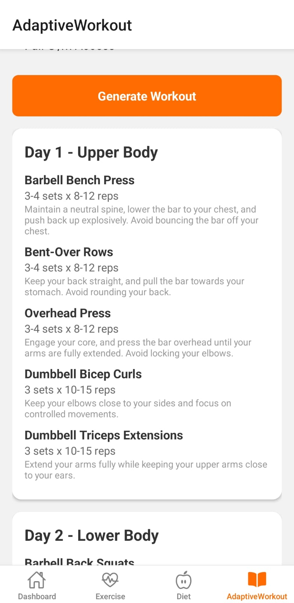

# FiteX

FiteX is a modern fitness application designed to help users achieve their health and wellness goals. With tools to track workouts, monitor progress, and stay motivated through personalized exercise routines and meal plans, FiteX simplifies your fitness journey.

## 🚀 Features

### 🏋️‍♀️ **Workout Management**

- Start, pause, and reset timers for exercises with intuitive visual feedback.
- Track progress with **animated circular progress indicators**.

### 📋 **Exercise Routines**

- Predefined exercise routines tailored for all fitness levels: **Light**, **Medium**, and **Heavy**.

### 📊 **Dashboard**

- Stay on top of your daily fitness goals with metrics like:
  - **Steps taken**
  - **Calories burned**
  - **Water intake**

### 🔥 **Activity Heatmap**

- Visualize your activity trends and monitor consistency over time.

### 🍽️ **Personalized Meal Plan Generator**

- Generate customized meal plans based on your preferences using **Google Generative AI**.

### 🔐 **User Authentication**

- Secure sign-up and login screens to manage your personal fitness data.

## 🛠️ Technologies Used

- **React Native**: For building the cross-platform mobile application.
- **Expo**: Simplifying development and deployment.
- **Google Generative AI**: Crafting meal plans tailored to user preferences.
- **React Navigation**: For seamless navigation between screens.
- **Animated API**: Enabling smooth and engaging animations.
- **SVG**: For rendering dynamic circular progress indicators.

## 📸 Images  

### Login  
  

### Dashboard  
  

### Activity Heatmap  
  

### Exercise Controls  
  

### AI Powered Meal Plan  
  
  

### Workout  
  

## 📝 License

This project is licensed under the **[Proprietary License](./LICENSE)**. Unauthorized copying, distribution, or modification is strictly prohibited without prior written permission from the author.

## ⚡ Getting Started

### Prerequisites

Ensure you have the following installed:

- **Node.js**
- **Expo CLI**

### Usage

1. Open the application on an emulator or physical device using the Expo app.
2. Sign up or log in to access personalized features.
3. Explore:
   - Discover **exercise routines** suited to your fitness level.
   - Track your progress with the **dashboard** and **activity heatmap**.
   - Generate tailored **meal plans** to complement your fitness routine.

## 👥 Contact

For inquiries, support, or feedback, please contact **Vaibhav Kothari** at:  
📧 **[vaibhavkothari50@gmail.com](mailto:vaibhavkothari50@gmail.com)**

Stay fit, stay strong, and keep pushing your limits with **FiteX**! 💪
